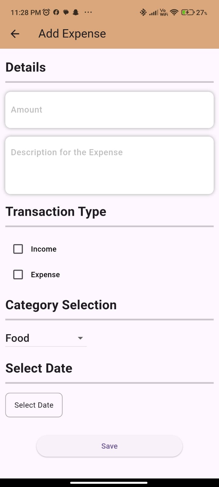
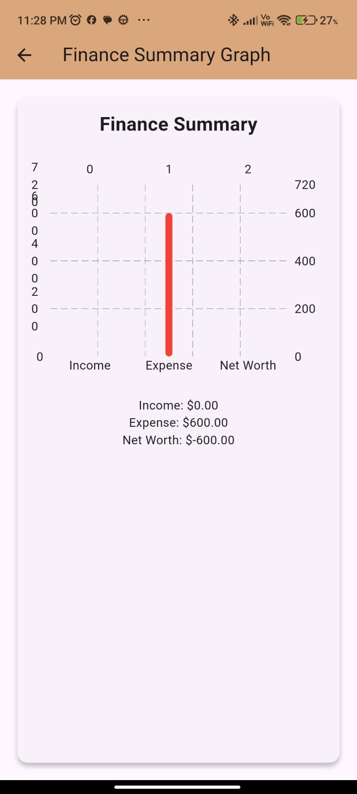

# 💰 Expense Manager App

A simple yet powerful Expense Manager built with **Flutter**, using **GetX** for state management, **SharedPreferences** for local storage, and **fl_chart** for dynamic expense graphing.

<p align="center">
  
  
  
</p>

---

## 🚀 Features

- ✅ Add new income or expense transactions
- ✅ Edit or update existing transactions
- ✅ Select from predefined categories
- ✅ Add custom categories dynamically
- ✅ Choose transaction date with date picker
- ✅ Visualize spending using graphs (`fl_chart`)
- ✅ Local data persistence using `SharedPreferences`
- ✅ Simple and responsive UI
- ✅ State management with `GetX`

---

## 📸 Screenshots

| Dashboard | Add Expense | Expense Graph |
|----------|-------------|----------------|
|  |  |  |

> 🔧 Make sure the images exist in the `assets/screenshots/` folder.

---

## 🛠️ Tech Stack

| Technology       | Purpose                        |
|------------------|-------------------------------|
| Flutter          | UI Toolkit                     |
| GetX             | State Management, Navigation   |
| fl_chart         | Data visualization             |
| SharedPreferences| Local storage (key-value)      |

---


---

## 🧪 Getting Started

### 1. Clone the Repo
```bash
git clone https://github.com/yourusername/expense_manager.git
cd expense_manager
```
###2. install dependencies
```bash
flutter pub get
```
###3. Run the App
``` bash
flutter run
```
##📦Dependencies

dependencies:
  flutter:
    sdk: flutter
  get: ^4.6.6
  shared_preferences: ^2.2.2
  intl: ^0.18.1
  fl_chart: ^0.63.0

